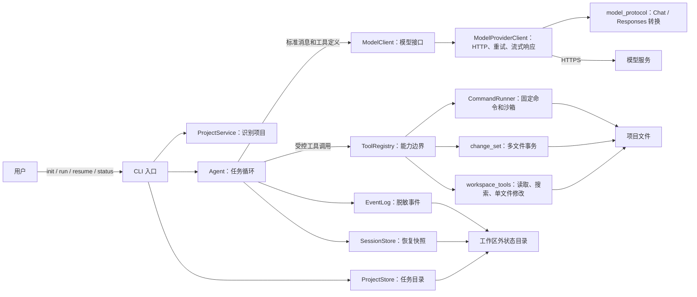
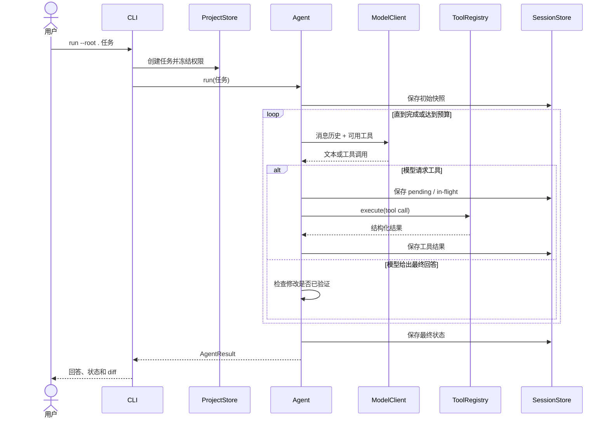
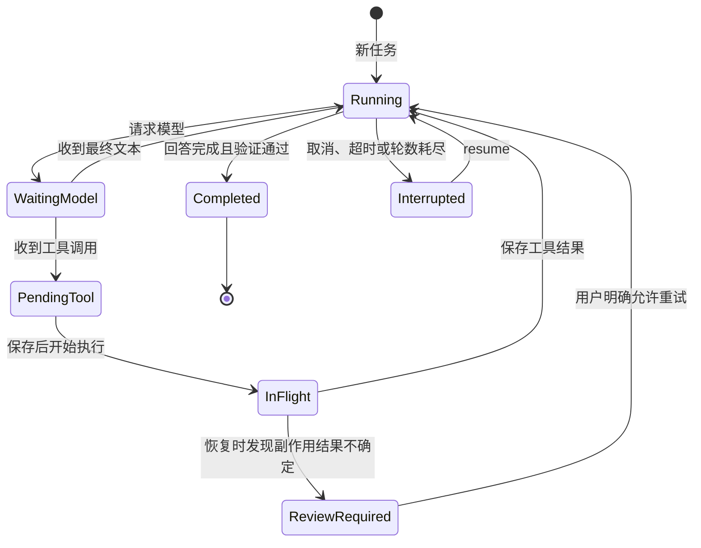
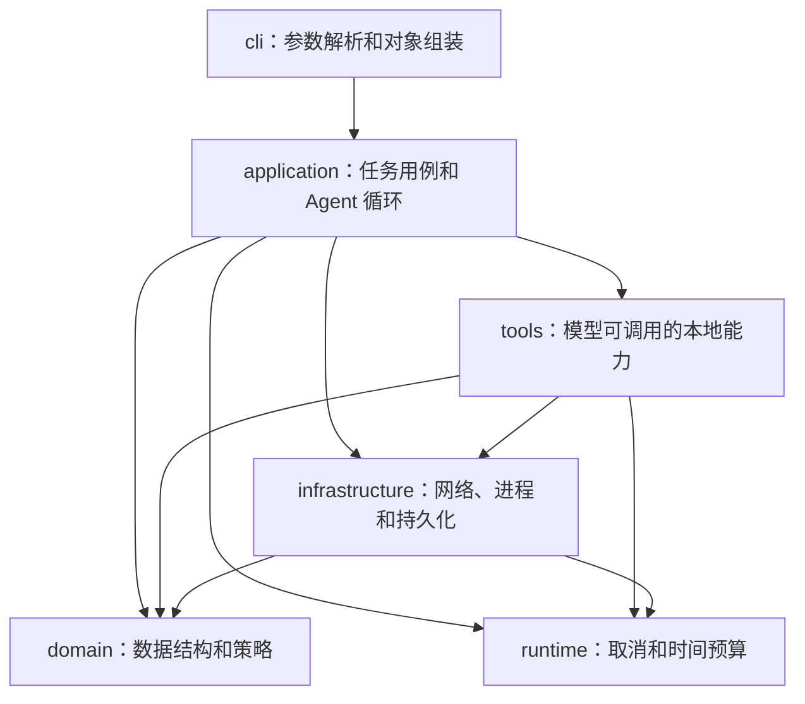
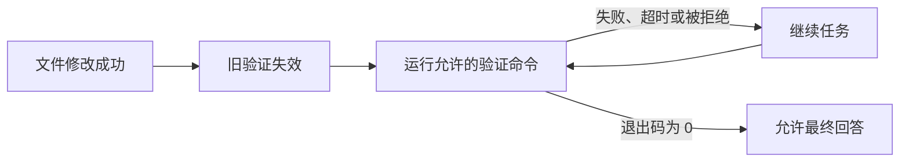

# aiagent 架构与代码导读

这份文档面向第一次阅读项目代码的人。先用图理解一次任务如何运行，再按推荐顺序进入源码。

可编辑版本：[在 FigJam 打开模块总览、任务时序和恢复状态](https://www.figma.com/board/3Kop2k91xg5vLoz8yT2lIY)。

## 1. 先看结论

aiagent 是一个**分层单体 CLI**，不是服务端，也不是微服务。

它只有一条主链路：

1. CLI 读取用户命令和本地配置；
2. Agent 向模型询问下一步；
3. 模型只能调用 ToolRegistry 暴露的工具；
4. 工具在授权范围内读文件、改文件或运行固定命令；
5. 每个关键状态都写入本地任务目录，任务可以恢复；
6. 如果项目发生修改，验证门禁可以要求测试通过后才结束。

Agent 本身不直接访问网络、文件系统或启动进程。这些副作用都放在可替换、可测试的实现中。

## 2. 系统总览



图中最重要的两个边界：

- **ModelClient** 隔离模型厂商差异。Agent 不知道自己连接的是 Chat Completions 还是 Responses。
- **ToolRegistry** 隔离副作用。模型只能看到当前任务明确允许的工具和参数。

## 3. 一次任务是怎样运行的



关键点是：**先保存即将执行的工具，再执行副作用，最后保存结果**。如果进程恰好在工具执行期间崩溃，恢复逻辑可以判断该操作是否可能已经发生，而不是盲目重放。

## 4. 恢复状态



只读工具可以安全重试。写文件或运行命令如果停在 InFlight，默认要求用户先检查现场，再决定是否重试。

## 5. 代码分层



这是务实的分层单体，不刻意追求“纯净架构”形式。依赖方向由 CMake target 固定：

| Target | 主要职责 | 可以依赖 |
|---|---|---|
| `aiagent_domain` | 模型数据、任务策略、变更记录 | JSON 库 |
| `aiagent_runtime` | 取消信号、总时间预算 | 标准库 |
| `aiagent_infrastructure` | HTTP、命令、配置和存储 | domain、runtime |
| `aiagent_tools` | 文件工具、事务修改、工具路由 | domain、runtime、infrastructure |
| `aiagent_application` | Agent 循环和项目识别 | 上述四层 |
| `aiagent` | CLI 可执行文件 | `aiagent_core` |

`aiagent_core` 是给嵌入方使用的稳定聚合 target，隐藏内部 target 的拆分。

## 6. 每个目录放什么

```text
include/aiagent/
  application/       Agent 和项目用例的公共接口
  domain/            不包含 I/O 的核心数据与策略
  infrastructure/    网络、进程和存储接口
  runtime/           任务取消与时间预算
  tools/             本地工具公共接口
  *.hpp              旧版兼容转发头

src/
  cli/               命令行解析和 composition root
  application/       Agent 主循环、上下文、状态和提示
  domain/            TaskPolicy、ChangeJournal
  infrastructure/    Provider、协议、命令执行和存储
  runtime/           TaskControl
  tools/             工具注册、工作区文件操作和事务修改

tests/
  aiagent_tests.cpp   核心回归与安全边界
  v1_2/              策略、恢复和验证
  v1_3/              项目和任务工作流
  v1_4/              Provider、SSE 和 CLI 闭环
```

## 7. Application：任务循环

`src/application` 按“为什么会修改”拆分，而不是全部堆在 Agent 类中：

| 文件 | 负责什么 |
|---|---|
| `agent.cpp` | 任务循环、checkpoint 时机、恢复和验证门禁 |
| `agent_context.cpp` | 控制发给模型的上下文大小，同时保持工具调用配对 |
| `agent_state.cpp` | 执行统计、模型统计、JSON 序列化和终端摘要 |
| `agent_prompt.cpp` | 根据当前权限生成系统提示 |
| `agent_support.hpp` | 上述实现文件之间的内部接口，不属于公共 API |
| `project_service.cpp` | 识别 CMake、Cargo、npm，并提出最小能力建议 |

阅读 `Agent::run` 时只需记住四个局部状态：

- `messages`：完整对话历史；
- `pending_calls`：模型已经请求、尚未执行的工具；
- `in_flight_call`：已经开始但结果还未持久化的工具；
- `AgentResult`：用户最终看到的汇总。

## 8. Tools：模型能做什么

`ToolRegistry` 是能力总入口。它根据任务权限决定向模型暴露哪些工具：

| 工具 | 用途 |
|---|---|
| `list_files` | 查看目录 |
| `search_text` | 搜索文本 |
| `read_file` | 分块读取文本文件 |
| `apply_patch` | 创建文件或精确替换一个文本块 |
| `apply_changeset` | 一次提交多个创建、替换、删除或移动 |
| `workspace_changes` | 查看本次任务产生的净 diff |
| `run_recipe` | 运行初始化时固定的构建或测试命令 |

实现按职责拆分：

- `tool_registry.cpp`：权限状态、工具定义和调用路由；
- `workspace_tools.cpp`：路径解析、读取、搜索和单文件修改；
- `change_set.cpp`：多文件预检查、提交和失败回滚；
- `tool_support.cpp`：共享参数与路径校验；
- `command_runner.cpp`：进程、超时、输出限制和 OS 沙箱。

没有通用 shell 工具。模型不能临时拼出任意命令。

## 9. Infrastructure：把外部世界接进来

### 模型

`ModelProviderClient` 负责 HTTP、超时、取消、重试和流式传输。
`model_protocol.cpp` 只做协议转换，不访问网络：

```text
Agent messages
    -> Chat Completions 或 Responses 请求
    -> HTTP / SSE
    -> provider 原始响应
    -> ModelReply
    -> Agent
```

这种拆分让协议测试不需要真实网络，也让 Agent 不出现 provider 分支。

### 命令

`CommandRunner` 接收已经固定的 program、argv、cwd 和 timeout，不解释 shell 字符串。macOS 参考实现会把命令放入 Seatbelt；它是额外安全边界，但不等于容器。

### 状态

- `ProjectStore`：项目资料、任务列表、每个任务的权限快照；
- `SessionStore`：Agent 恢复所需的完整 checkpoint；
- `EventLog`：用于观察执行过程的脱敏 JSONL；
- `ChangeJournal`：从任务开始到当前的净文件变化。

模型配置和任务状态都被列为受保护路径，工具不能读取或修改它们。

## 10. 修改后的验证门禁



模型说“测试通过了”不算证据。只有最新修改之后实际运行、并且返回成功的验证命令才算通过。

## 11. 推荐阅读顺序

1. `src/cli/main.cpp`：看程序如何组装所有对象；
2. `src/application/agent.cpp`：看一轮模型和工具如何循环；
3. `src/tools/tool_registry.cpp`：看模型最终获得哪些能力；
4. `src/tools/workspace_tools.cpp`：看路径边界和文件读取；
5. `include/aiagent/infrastructure/model_provider_client.hpp` 与
   `src/infrastructure/model_protocol.cpp`：看模型协议如何归一化；
6. `src/infrastructure/command_runner.cpp`：看命令执行边界；
7. `src/infrastructure/project_store.cpp` 与
   `src/infrastructure/session_store.cpp`：看任务如何保存和恢复；
8. `tests/v1_3`、`tests/v1_4`：从契约测试反向验证理解。

## 12. 当前边界

- macOS arm64 是完整参考实现；
- Linux 和 Windows 尚无正式安全命令后端；
- Seatbelt 不是容器；
- 当前没有 GUI 或多 Agent 编排；
- 本地假 Provider 测试只证明协议和传输闭环，不代表所有真实服务都兼容。

构建与测试：

```bash
cmake -S . -B build/dev \
  -DCMAKE_BUILD_TYPE=Debug \
  -DAIAGENT_WARNINGS_AS_ERRORS=ON
cmake --build build/dev
ctest --test-dir build/dev --output-on-failure
```
