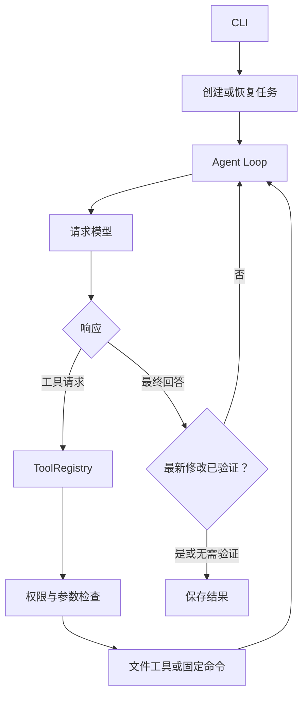
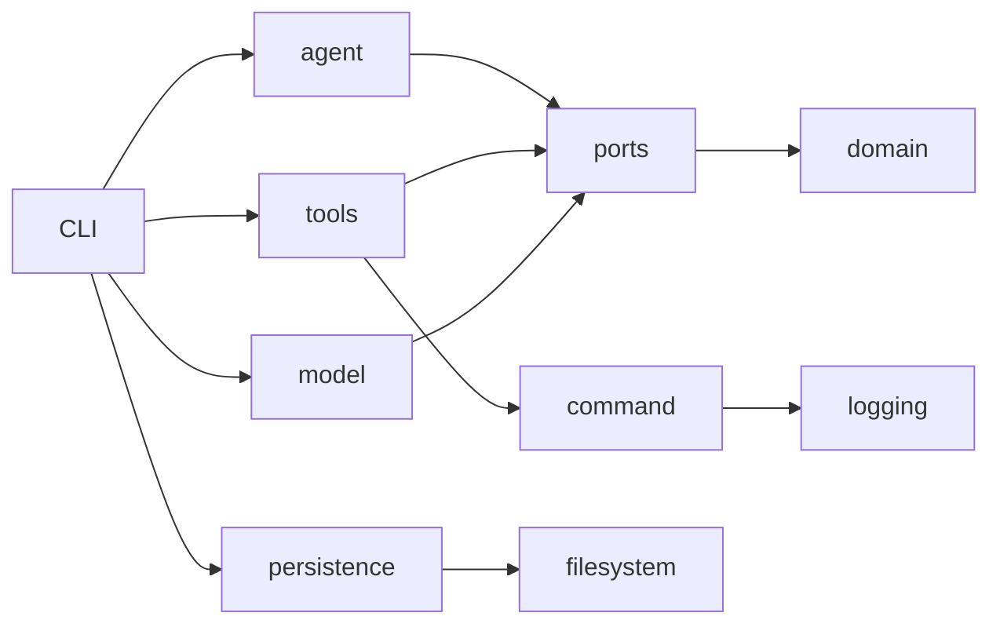

# 架构

[← 返回文档树](../../README.md)

mint 把模型判断和本地执行分开：模型只能返回文字或工具请求，文件和进程操作全部由本地代码完成。

## 一次任务



每轮都会保存 checkpoint。模型直接回答且没有待验证修改时，任务只需要一次请求；Agent Loop 不是固定轮数的工作流。

## 模块

| 模块 | 职责 |
|---|---|
| `src/application/agent` | Agent Loop、上下文、checkpoint 和结果汇总 |
| `src/application/project_service.cpp` | 项目识别和初始策略 |
| `src/domain` | policy、运行限制、模型数据和变更记录 |
| `include/mint/ports` | 模型、工具、会话、事件和停止信号接口 |
| `src/tools` | 工具目录、工作区访问和变更事务 |
| `src/infrastructure/model` | 配置、HTTP、SSE 和协议转换 |
| `src/infrastructure/command` | 进程、资源限制和平台沙箱 |
| `src/infrastructure/persistence` | 项目、会话、事件和变更事务存储 |
| `src/infrastructure/logging` | 结构化诊断日志 |
| `src/infrastructure/filesystem` | 输出路径和私有文件权限 |
| `src/localization`、`locales` | 中英文文案和类型化消息 ID |
| `src/runtime` | 路径、取消、审批和终端文本等通用规则 |
| `src/cli` | 参数解析和依赖组装 |

复杂模块再按功能分组：

```text
src/cli/
├── agent/       任务运行与事件路由
├── project/     init、resume、status 的项目状态
├── provider/    配置检查与真实握手
├── support/     终端与诊断日志适配
├── command_line.*
└── main.cpp

src/tools/
├── registry/    工具名、Schema、路由与命令入口
├── workspace/   路径安全、读取、搜索和单文件编辑
└── changes/     changeset、事务与命令变更跟踪
```

目录边界也是编译边界。application 只依赖 domain、runtime、localization 和 ports；具体实现由 CLI 组装。



`tests/cmake` 中的架构契约会检查依赖方向、终端输出边界和模块目录，防止实现重新堆回聚合文件夹。

## 模型适配

Agent 只认识 `ModelClient` 和统一的 `ModelReply`。供应商配置先解析为 `ProviderProfile`，再由 adapter 生成请求并解析响应：

```text
config.json → ProviderProfile → protocol adapter → HTTP/SSE → ModelReply
```

现有 adapter 和供应商配置见[模型配置](../reference/model-providers.md)。接入同协议的新服务通常只需增加模板和 profile；只有 wire format 不兼容时才增加 adapter。

## 工具边界

`ToolRegistry` 实现 `AgentTools`，但工具协议和实现分开：

- `registry` 定义稳定工具名、参数 Schema 和路由；
- `workspace` 负责路径解析和文件操作；
- `changes` 负责审计、事务和恢复；
- 命令执行委托给 infrastructure 的 `CommandRunner`。

公开头文件只暴露任务需要的接口和配置。实现细节留在 `src`，新增工具不应让 application 依赖具体文件系统或进程类型。

## 本地状态

| 文件 | 内容 |
|---|---|
| `session.json` | 模型上下文、checkpoint 和最终结果 |
| `events.jsonl` | 工具、审批和验证事件 |
| `policy.json` | 文件、命令和资源权限 |
| `logs/mint-*.jsonl` | 不含正文的运行诊断 |

托管任务状态位于工作区之外。安全边界和恢复规则见[安全与恢复](../guides/safety-and-recovery.md)。
